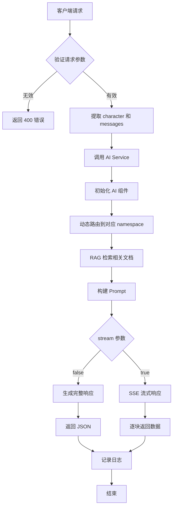
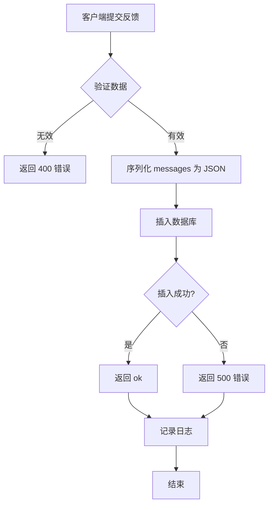

# 后端架构设计文档

## 📋 项目概述

本后端服务为"社会学大师陪伴智能体"项目提供 RESTful API 接口，支持与 AI 智能体的对话交互和用户反馈遥测数据收集。

---

## 🏗️ 技术栈

### 核心框架
- **FastAPI**: 现代、高性能的 Python Web 框架
  - 自动生成 OpenAPI 文档
  - 原生支持异步处理
  - 内置数据验证（Pydantic）
  - 优秀的 SSE（Server-Sent Events）支持

### 数据存储
- **SQLite**: 轻量级关系型数据库
  - 零配置，文件型数据库
  - 适合中小规模应用
  - 支持 ACID 事务

### AI 集成
- **现有 AI 模块**: 基于 Pinecone + Gemini 的 RAG 系统
  - Pinecone: 向量数据库（知识检索）
  - Gemini 2.5 Flash: 大语言模型（对话生成）
  - LangChain: AI 应用框架

### 容器化
- **Docker**: 应用容器化
- **Docker Compose**: 多容器编排

---

## 📁 项目结构

```
isse-project/
├── backend/
│   ├── app/
│   │   ├── __init__.py
│   │   ├── main.py                 # FastAPI 应用入口
│   │   ├── config.py               # 配置管理
│   │   ├── database.py             # 数据库连接和会话管理
│   │   ├── models.py               # SQLAlchemy ORM 模型
│   │   ├── schemas.py              # Pydantic 数据模型
│   │   ├── api/
│   │   │   ├── __init__.py
│   │   │   ├── chat.py             # 聊天接口
│   │   │   └── telemetry.py        # 遥测接口
│   │   ├── services/
│   │   │   ├── __init__.py
│   │   │   ├── ai_service.py       # AI 服务封装
│   │   │   └── telemetry_service.py # 遥测服务
│   │   └── utils/
│   │       ├── __init__.py
│   │       └── logger.py           # 日志工具
│   ├── tests/
│   │   ├── __init__.py
│   │   ├── test_chat.py
│   │   └── test_telemetry.py
│   ├── Dockerfile
│   ├── docker-compose.yml
│   ├── requirements.txt
│   ├── .env.example
│   └── README.md
├── ai/                              # 现有 AI 模块
│   ├── chat_agent.py
│   ├── build_index.py
│   └── .env
├── data/                            # 知识库数据
└── docs/
    └── api/
        └── api.md                   # API 规范文档
```

---

## 🗄️ 数据库设计

### Telemetry 表（遥测数据）

```sql
CREATE TABLE telemetry (
    id INTEGER PRIMARY KEY AUTOINCREMENT,
    user_id TEXT NOT NULL,              -- 用户 UUID
    overall_rating INTEGER NOT NULL,     -- 1-10 评分
    comment TEXT,                        -- 用户评论
    messages TEXT NOT NULL,              -- JSON 格式的消息记录
    created_at TIMESTAMP DEFAULT CURRENT_TIMESTAMP,
    INDEX idx_user_id (user_id),
    INDEX idx_created_at (created_at)
);
```

### ChatSession 表（可选，用于会话追踪）

```sql
CREATE TABLE chat_sessions (
    id TEXT PRIMARY KEY,                 -- 会话 UUID
    user_id TEXT,                        -- 用户 UUID
    character TEXT NOT NULL,             -- 角色名称
    created_at TIMESTAMP DEFAULT CURRENT_TIMESTAMP,
    updated_at TIMESTAMP DEFAULT CURRENT_TIMESTAMP,
    INDEX idx_user_id (user_id)
);
```

---

## 🔌 API 接口设计

### 1. GET /api/v1/chat

**功能**: 与 AI 智能体对话

**请求体**:
```json
{
    "character": "tocqueville",
    "messages": [
        {"role": "user", "content": "托克维尔对美国民主的看法是什么？"}
    ],
    "stream": false,
    "temperature": 0.5
}
```

**响应体（非流式）**:
```json
{
    "result": {
        "message": {
            "role": "assistant",
            "content": "我曾亲身踏足美洲大陆..."
        },
        "finish_reason": "stop"
    },
    "usage": {
        "prompt_tokens": 114,
        "completion_tokens": 514,
        "total_tokens": 628,
        "prompt_tokens_details": {"cached_tokens": 90}
    },
    "created": 1762669782,
    "id": "toc-9303a5a3-325f-4855-98b8-34de84a8a9af"
}
```

**响应体（流式 SSE）**:
```
data: {"result": {"delta": {"role": "assistant", "content": ""}, "finish_reason": null}, ...}
data: {"result": {"delta": {"content": "我曾"}, "finish_reason": null}, ...}
data: {"result": {"delta": {"content": "亲身"}, "finish_reason": null}, ...}
...
data: [DONE]
```

### 2. POST /api/v1/telemetry

**功能**: 收集用户反馈和遥测数据

**请求体**:
```json
{
    "user_id": "8f9678c0-979f-40b9-b0e8-d4544ae77b66",
    "rating": {
        "overall_rating": 8,
        "comment": "回答很有深度"
    },
    "messages": [
        {"role": "assistant", "content": "..."}
    ]
}
```

**响应体**:
```json
{
    "result": "ok"
}
```

---

## 🔄 核心流程

### Chat 接口流程



### Telemetry 接口流程



---

## 🔧 核心组件设计

### 1. AI Service 封装

**职责**: 封装现有 [`chat_agent.py`](../ai/chat_agent.py) 的功能，提供统一接口

**关键方法**:
```python
class AIService:
    def __init__(self):
        # 初始化 Pinecone、Gemini、VectorStore
        
    async def chat(
        self, 
        character: str, 
        messages: List[Message],
        temperature: float = 0.5,
        stream: bool = False
    ) -> Union[ChatResponse, AsyncGenerator]:
        # 执行 RAG 检索和对话生成
        
    def _get_namespace(self, character: str) -> str:
        # 将 character 映射到 Pinecone namespace
        
    async def _generate_stream(self, prompt, context) -> AsyncGenerator:
        # 流式生成响应
```

### 2. Telemetry Service

**职责**: 处理遥测数据的存储和查询

**关键方法**:
```python
class TelemetryService:
    def __init__(self, db: Session):
        self.db = db
        
    async def save_feedback(
        self,
        user_id: str,
        rating: Rating,
        messages: List[Message]
    ) -> bool:
        # 保存用户反馈到数据库
        
    async def get_user_feedback(self, user_id: str) -> List[Telemetry]:
        # 查询用户历史反馈（可选功能）
```

### 3. 配置管理

**职责**: 统一管理环境变量和配置

```python
class Settings(BaseSettings):
    # API 配置
    API_V1_PREFIX: str = "/api/v1"
    PROJECT_NAME: str = "Sociology Master Chat API"
    
    # 数据库配置
    DATABASE_URL: str = "sqlite:///./backend.db"
    
    # AI 配置
    PINECONE_API_KEY: str
    GEMINI_API_KEY: str
    PINECONE_INDEX_NAME: str = "sociology-master"
    
    # CORS 配置
    ALLOWED_ORIGINS: List[str] = ["http://localhost:3000"]
    
    class Config:
        env_file = ".env"
```

---

## 🛡️ 错误处理策略

### HTTP 状态码规范

| 状态码 | 场景 | 示例 |
|--------|------|------|
| 200 | 成功 | 正常返回数据 |
| 400 | 请求参数错误 | 缺少必填字段、格式错误 |
| 404 | 资源不存在 | 无效的 character |
| 500 | 服务器内部错误 | AI 服务异常、数据库错误 |
| 503 | 服务不可用 | Pinecone/Gemini API 超时 |

### 错误响应格式

```json
{
    "error": {
        "code": "INVALID_CHARACTER",
        "message": "不支持的角色: unknown_character",
        "details": "可用角色: tocqueville, common"
    }
}
```

---

## 📊 日志策略

### 日志级别

- **DEBUG**: 详细的调试信息（开发环境）
- **INFO**: 关键操作记录（API 调用、数据库操作）
- **WARNING**: 潜在问题（API 限流、慢查询）
- **ERROR**: 错误信息（异常捕获、失败操作）
- **CRITICAL**: 严重错误（服务崩溃）

### 日志内容

```python
# 示例日志
logger.info(
    "Chat request received",
    extra={
        "character": "tocqueville",
        "message_count": 3,
        "stream": False,
        "user_id": "xxx"
    }
)
```

---

## 🚀 部署架构

### Docker Compose 服务

```yaml
services:
  backend:
    build: ./backend
    ports:
      - "8000:8000"
    environment:
      - PINECONE_API_KEY=${PINECONE_API_KEY}
      - GEMINI_API_KEY=${GEMINI_API_KEY}
    volumes:
      - ./backend/data:/app/data
      - ./data:/app/knowledge_data
    depends_on:
      - db
      
  db:
    image: sqlite:latest  # 或使用文件挂载
    volumes:
      - ./backend/db:/data
```

---

## 🔐 安全考虑

1. **API 密钥保护**: 使用环境变量，不提交到版本控制
2. **CORS 配置**: 限制允许的前端域名
3. **输入验证**: 使用 Pydantic 严格验证所有输入
4. **SQL 注入防护**: 使用 SQLAlchemy ORM
5. **速率限制**: 可选添加 slowapi 中间件

---

## 📈 性能优化

1. **异步处理**: 使用 FastAPI 的异步特性
2. **连接池**: 复用 Pinecone 和 Gemini 连接
3. **缓存策略**: 
   - 缓存常见问题的 embedding
   - 缓存 namespace 路由结果
4. **流式响应**: 减少首字节时间（TTFB）

---

## 🧪 测试策略

### 单元测试
- AI Service 各方法测试
- Telemetry Service CRUD 测试
- 数据模型验证测试

### 集成测试
- API 端到端测试
- 数据库集成测试
- AI 模块集成测试

### 测试工具
- **pytest**: 测试框架
- **httpx**: 异步 HTTP 客户端
- **pytest-asyncio**: 异步测试支持

---

## 📝 开发优先级

### Phase 1: 核心功能（MVP）
1. ✅ 项目结构搭建
2. ✅ 数据库模型定义
3. ✅ Chat 接口（非流式）
4. ✅ Telemetry 接口
5. ✅ AI Service 集成

### Phase 2: 增强功能
1. ⏳ Chat 接口（流式 SSE）
2. ⏳ 错误处理完善
3. ⏳ 日志系统
4. ⏳ Docker 容器化

### Phase 3: 优化和测试
1. ⏳ 单元测试
2. ⏳ 性能优化
3. ⏳ API 文档完善
4. ⏳ 部署文档

---

## 🔗 相关文档

- [API 规范](../docs/api/api.md)
- [AI 模块说明](../ai/ai.md)
- [FastAPI 官方文档](https://fastapi.tiangolo.com/)
- [Pydantic 文档](https://docs.pydantic.dev/)
- [SQLAlchemy 文档](https://docs.sqlalchemy.org/)

---

## 📞 技术支持

如有问题，请参考：
1. 项目 README
2. API 文档
3. 代码注释
4. 单元测试示例