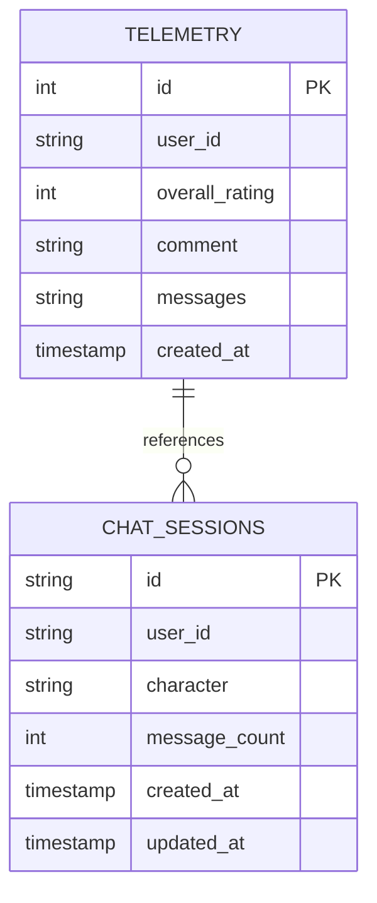

# 数据库设计文档

## 📊 数据库概述

本项目使用 **SQLite** 作为轻量级关系型数据库，主要用于存储用户反馈遥测数据和会话信息。

---

## 🗄️ 数据表设计

### 1. telemetry（遥测数据表）

**用途**: 存储用户对 AI 对话的评价和反馈

**表结构**:

| 字段名 | 类型 | 约束 | 说明 |
|--------|------|------|------|
| id | INTEGER | PRIMARY KEY AUTOINCREMENT | 自增主键 |
| user_id | TEXT | NOT NULL | 用户 UUID |
| overall_rating | INTEGER | NOT NULL, CHECK(overall_rating >= 1 AND overall_rating <= 10) | 整体评分（1-10） |
| comment | TEXT | NULLABLE | 用户评论文本 |
| messages | TEXT | NOT NULL | JSON 格式的消息记录 |
| created_at | TIMESTAMP | DEFAULT CURRENT_TIMESTAMP | 创建时间 |

**索引**:
```sql
CREATE INDEX idx_telemetry_user_id ON telemetry(user_id);
CREATE INDEX idx_telemetry_created_at ON telemetry(created_at);
CREATE INDEX idx_telemetry_rating ON telemetry(overall_rating);
```

**SQL 创建语句**:
```sql
CREATE TABLE telemetry (
    id INTEGER PRIMARY KEY AUTOINCREMENT,
    user_id TEXT NOT NULL,
    overall_rating INTEGER NOT NULL CHECK(overall_rating >= 1 AND overall_rating <= 10),
    comment TEXT,
    messages TEXT NOT NULL,
    created_at TIMESTAMP DEFAULT CURRENT_TIMESTAMP
);

CREATE INDEX idx_telemetry_user_id ON telemetry(user_id);
CREATE INDEX idx_telemetry_created_at ON telemetry(created_at);
CREATE INDEX idx_telemetry_rating ON telemetry(overall_rating);
```

**示例数据**:
```json
{
    "id": 1,
    "user_id": "8f9678c0-979f-40b9-b0e8-d4544ae77b66",
    "overall_rating": 8,
    "comment": "回答很有深度，但有些地方过于学术化",
    "messages": "[{\"role\": \"assistant\", \"content\": \"我曾亲身踏足美洲大陆...\"}]",
    "created_at": "2025-01-16 12:30:45"
}
```

---

### 2. chat_sessions（会话表，可选）

**用途**: 追踪用户的对话会话，用于分析和统计

**表结构**:

| 字段名 | 类型 | 约束 | 说明 |
|--------|------|------|------|
| id | TEXT | PRIMARY KEY | 会话 UUID |
| user_id | TEXT | NULLABLE | 用户 UUID（可选） |
| character | TEXT | NOT NULL | 角色名称（如 tocqueville） |
| message_count | INTEGER | DEFAULT 0 | 消息数量 |
| created_at | TIMESTAMP | DEFAULT CURRENT_TIMESTAMP | 创建时间 |
| updated_at | TIMESTAMP | DEFAULT CURRENT_TIMESTAMP | 最后更新时间 |

**索引**:
```sql
CREATE INDEX idx_sessions_user_id ON chat_sessions(user_id);
CREATE INDEX idx_sessions_character ON chat_sessions(character);
CREATE INDEX idx_sessions_created_at ON chat_sessions(created_at);
```

**SQL 创建语句**:
```sql
CREATE TABLE chat_sessions (
    id TEXT PRIMARY KEY,
    user_id TEXT,
    character TEXT NOT NULL,
    message_count INTEGER DEFAULT 0,
    created_at TIMESTAMP DEFAULT CURRENT_TIMESTAMP,
    updated_at TIMESTAMP DEFAULT CURRENT_TIMESTAMP
);

CREATE INDEX idx_sessions_user_id ON chat_sessions(user_id);
CREATE INDEX idx_sessions_character ON chat_sessions(character);
CREATE INDEX idx_sessions_created_at ON chat_sessions(created_at);
```

**示例数据**:
```json
{
    "id": "toc-9303a5a3-325f-4855-98b8-34de84a8a9af",
    "user_id": "8f9678c0-979f-40b9-b0e8-d4544ae77b66",
    "character": "tocqueville",
    "message_count": 5,
    "created_at": "2025-01-16 12:00:00",
    "updated_at": "2025-01-16 12:30:45"
}
```

---

## 🔗 实体关系图（ER Diagram）



---

## 📝 SQLAlchemy ORM 模型

### Telemetry 模型

```python
from sqlalchemy import Column, Integer, String, Text, DateTime, CheckConstraint
from sqlalchemy.sql import func
from .database import Base

class Telemetry(Base):
    __tablename__ = "telemetry"
    
    id = Column(Integer, primary_key=True, index=True, autoincrement=True)
    user_id = Column(String, nullable=False, index=True)
    overall_rating = Column(
        Integer, 
        nullable=False,
        # 添加检查约束：评分必须在 1-10 之间
    )
    comment = Column(Text, nullable=True)
    messages = Column(Text, nullable=False)  # JSON 字符串
    created_at = Column(DateTime(timezone=True), server_default=func.now())
    
    __table_args__ = (
        CheckConstraint('overall_rating >= 1 AND overall_rating <= 10', name='check_rating_range'),
    )
```

### ChatSession 模型

```python
from sqlalchemy import Column, String, Integer, DateTime
from sqlalchemy.sql import func
from .database import Base

class ChatSession(Base):
    __tablename__ = "chat_sessions"
    
    id = Column(String, primary_key=True)  # UUID
    user_id = Column(String, nullable=True, index=True)
    character = Column(String, nullable=False, index=True)
    message_count = Column(Integer, default=0)
    created_at = Column(DateTime(timezone=True), server_default=func.now())
    updated_at = Column(DateTime(timezone=True), server_default=func.now(), onupdate=func.now())
```

---

## 🔍 常用查询示例

### 1. 插入遥测数据

```python
from sqlalchemy.orm import Session
import json

def save_telemetry(
    db: Session,
    user_id: str,
    overall_rating: int,
    comment: str,
    messages: list
):
    telemetry = Telemetry(
        user_id=user_id,
        overall_rating=overall_rating,
        comment=comment,
        messages=json.dumps(messages, ensure_ascii=False)
    )
    db.add(telemetry)
    db.commit()
    db.refresh(telemetry)
    return telemetry
```

### 2. 查询用户的所有反馈

```python
def get_user_feedback(db: Session, user_id: str):
    return db.query(Telemetry)\
        .filter(Telemetry.user_id == user_id)\
        .order_by(Telemetry.created_at.desc())\
        .all()
```

### 3. 统计平均评分

```python
from sqlalchemy import func

def get_average_rating(db: Session, character: str = None):
    query = db.query(func.avg(Telemetry.overall_rating))
    
    # 如果需要按角色筛选，可以通过 messages 字段解析
    # 这里简化处理，假设所有反馈
    
    return query.scalar()
```

### 4. 查询最近的反馈

```python
def get_recent_feedback(db: Session, limit: int = 10):
    return db.query(Telemetry)\
        .order_by(Telemetry.created_at.desc())\
        .limit(limit)\
        .all()
```

### 5. 创建或更新会话

```python
def create_or_update_session(
    db: Session,
    session_id: str,
    user_id: str,
    character: str
):
    session = db.query(ChatSession).filter(ChatSession.id == session_id).first()
    
    if session:
        session.message_count += 1
        session.updated_at = func.now()
    else:
        session = ChatSession(
            id=session_id,
            user_id=user_id,
            character=character,
            message_count=1
        )
        db.add(session)
    
    db.commit()
    db.refresh(session)
    return session
```

---

## 📊 数据分析查询

### 1. 按角色统计评分分布

```sql
-- 需要解析 messages JSON 字段，这里简化处理
SELECT 
    overall_rating,
    COUNT(*) as count
FROM telemetry
GROUP BY overall_rating
ORDER BY overall_rating DESC;
```

### 2. 查询低评分反馈（需要改进的地方）

```sql
SELECT 
    user_id,
    overall_rating,
    comment,
    created_at
FROM telemetry
WHERE overall_rating <= 5
ORDER BY created_at DESC
LIMIT 20;
```

### 3. 统计每日反馈数量

```sql
SELECT 
    DATE(created_at) as date,
    COUNT(*) as feedback_count,
    AVG(overall_rating) as avg_rating
FROM telemetry
GROUP BY DATE(created_at)
ORDER BY date DESC;
```

---

## 🔐 数据安全和隐私

### 1. 用户隐私保护

- **user_id**: 使用 UUID 而非真实身份信息
- **comment**: 不存储敏感个人信息
- **messages**: 仅存储对话内容，不包含 IP 地址等

### 2. 数据保留策略

```python
# 定期清理旧数据（可选）
def cleanup_old_telemetry(db: Session, days: int = 90):
    cutoff_date = datetime.now() - timedelta(days=days)
    db.query(Telemetry)\
        .filter(Telemetry.created_at < cutoff_date)\
        .delete()
    db.commit()
```

### 3. 数据备份

```bash
# SQLite 数据库备份
sqlite3 backend.db ".backup 'backup_$(date +%Y%m%d).db'"

# 或使用文件复制
cp backend.db backend_backup_$(date +%Y%m%d).db
```

---

## 🚀 数据库初始化

### 初始化脚本

```python
# database.py
from sqlalchemy import create_engine
from sqlalchemy.ext.declarative import declarative_base
from sqlalchemy.orm import sessionmaker

SQLALCHEMY_DATABASE_URL = "sqlite:///./backend.db"

engine = create_engine(
    SQLALCHEMY_DATABASE_URL,
    connect_args={"check_same_thread": False}  # SQLite 特定配置
)

SessionLocal = sessionmaker(autocommit=False, autoflush=False, bind=engine)

Base = declarative_base()

def init_db():
    """初始化数据库，创建所有表"""
    Base.metadata.create_all(bind=engine)

def get_db():
    """获取数据库会话"""
    db = SessionLocal()
    try:
        yield db
    finally:
        db.close()
```

### 使用示例

```python
# main.py
from fastapi import FastAPI
from .database import init_db

app = FastAPI()

@app.on_event("startup")
async def startup_event():
    """应用启动时初始化数据库"""
    init_db()
    print("数据库初始化完成")
```

---

## 📈 性能优化建议

### 1. 索引优化

- ✅ 已在 `user_id` 上创建索引（高频查询）
- ✅ 已在 `created_at` 上创建索引（时间范围查询）
- ✅ 已在 `overall_rating` 上创建索引（统计分析）

### 2. 查询优化

```python
# 使用分页避免一次性加载大量数据
def get_feedback_paginated(db: Session, skip: int = 0, limit: int = 100):
    return db.query(Telemetry)\
        .order_by(Telemetry.created_at.desc())\
        .offset(skip)\
        .limit(limit)\
        .all()
```

### 3. 连接池配置

```python
# 对于 SQLite，连接池配置较简单
engine = create_engine(
    SQLALCHEMY_DATABASE_URL,
    connect_args={"check_same_thread": False},
    pool_pre_ping=True,  # 检查连接有效性
    pool_recycle=3600    # 1小时回收连接
)
```

---

## 🧪 测试数据

### 插入测试数据脚本

```python
import json
from datetime import datetime, timedelta
import random

def insert_test_data(db: Session, count: int = 50):
    """插入测试遥测数据"""
    characters = ["tocqueville", "common"]
    comments = [
        "回答很有深度",
        "解释清晰易懂",
        "有些地方过于学术化",
        "希望能更简洁一些",
        "非常满意",
        None  # 有些用户不留评论
    ]
    
    for i in range(count):
        user_id = f"test-user-{random.randint(1, 10)}"
        rating = random.randint(1, 10)
        comment = random.choice(comments)
        
        messages = [
            {
                "role": "assistant",
                "content": f"这是测试回答 {i}"
            }
        ]
        
        telemetry = Telemetry(
            user_id=user_id,
            overall_rating=rating,
            comment=comment,
            messages=json.dumps(messages, ensure_ascii=False),
            created_at=datetime.now() - timedelta(days=random.randint(0, 30))
        )
        db.add(telemetry)
    
    db.commit()
    print(f"成功插入 {count} 条测试数据")
```

---

## 📚 相关文档

- [SQLAlchemy 官方文档](https://docs.sqlalchemy.org/)
- [SQLite 官方文档](https://www.sqlite.org/docs.html)
- [FastAPI 数据库集成](https://fastapi.tiangolo.com/tutorial/sql-databases/)
- [后端架构设计](./ARCHITECTURE.md)

---

## 🔄 数据库迁移（未来扩展）

如果需要更复杂的数据库迁移管理，可以使用 **Alembic**:

```bash
# 安装 Alembic
pip install alembic

# 初始化迁移环境
alembic init alembic

# 创建迁移脚本
alembic revision --autogenerate -m "Initial migration"

# 执行迁移
alembic upgrade head
```

---

## ✅ 数据库设计检查清单

- [x] 定义清晰的表结构
- [x] 添加必要的索引
- [x] 设置合适的约束（CHECK, NOT NULL）
- [x] 提供 ORM 模型定义
- [x] 编写常用查询示例
- [x] 考虑数据安全和隐私
- [x] 提供初始化脚本
- [x] 性能优化建议
- [x] 测试数据生成脚本